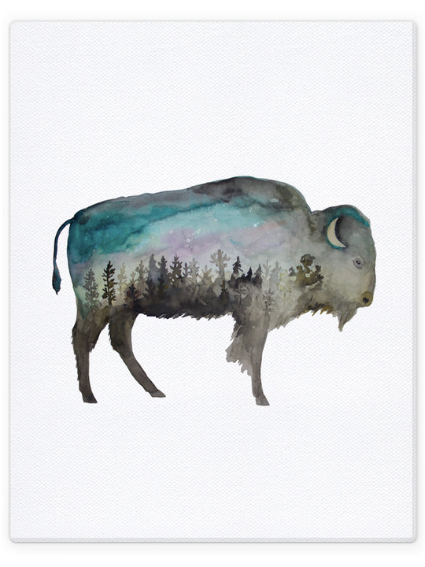
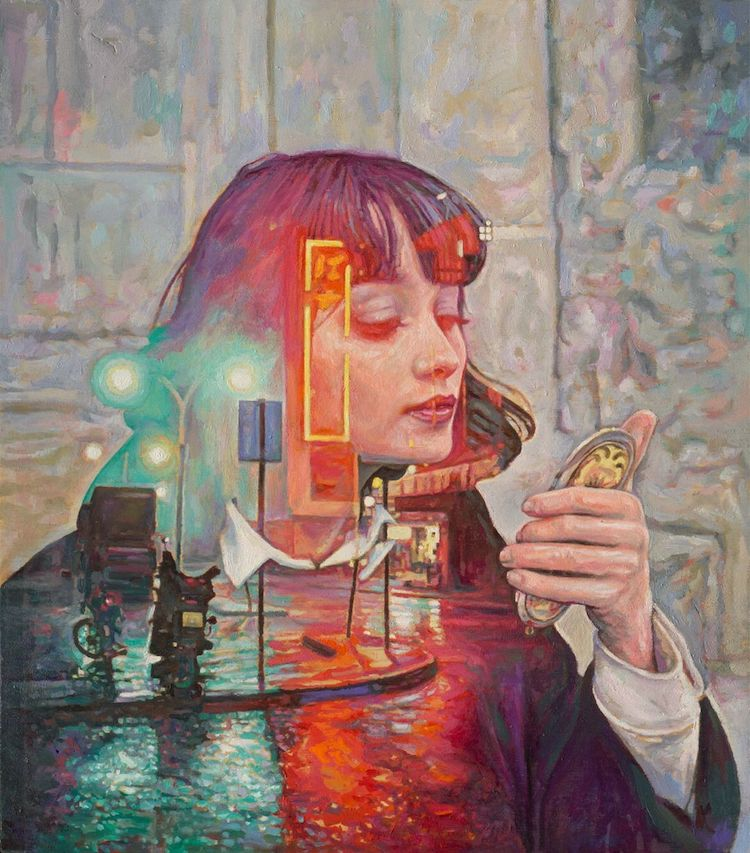
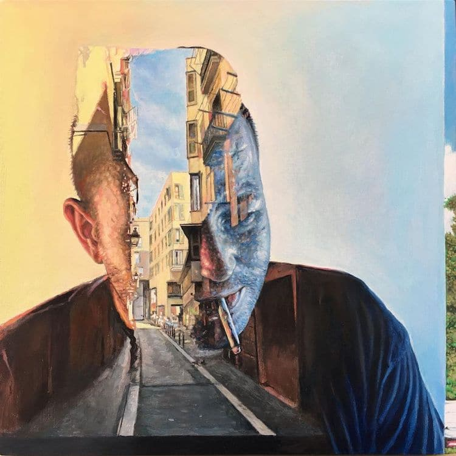
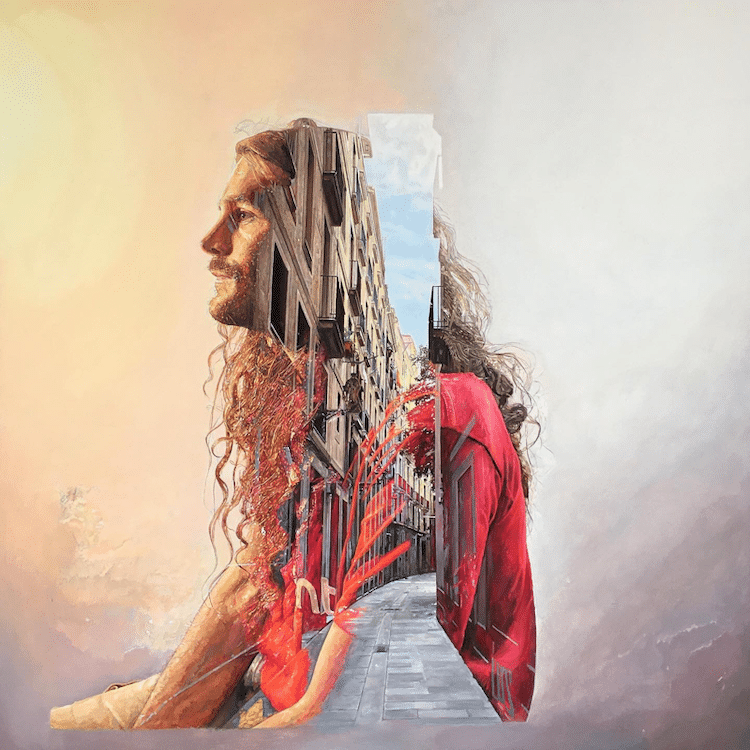
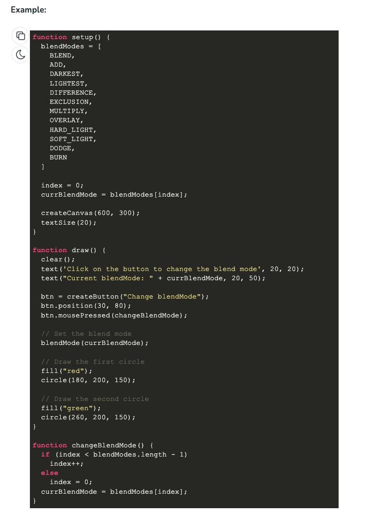

# **mzhe6329_9103_W8_quiz**
# *For Creative Coding Major Project*

## Part 1: Imaging Technique Inspiration

I am thoroughly enchanted by the **Double Exposure** technique prevalent in digital art and photography. It's the magical melding of two images to birth a singular visually arresting frame, opening doors to narrate complex tales through a single lens.

**Aspect to Incorporate**: 
- My aim is to harmonize portraits with the essence of nature or the heartbeat of urban landscapes, crafting artworks that mirror both personal identity and the ethos of environmental context.

**Benefits**:
- This technique lends a rich tapestry of meanings and narrative depths to the artwork, seamlessly aligning with the aspirations of my major project.

**Images**:
1. 
2. 
3. 
4. 
5. 

## Part 2: Coding Technique Exploration

My quest to digitally reincarnate the Double Exposure effect led me to the `blendMode()` function housed within **p5.js**, a JavaScript library. This function weaves two images into one using an array of modes like ADD, MULTIPLY, SCREEN, etc.

**How it Contributes**:
- Utilizing this function, the fusion of two images becomes a seamless affair, allowing fine-tuning of intensity and aesthetics, thus digitally mirroring the Double Exposure allure.
- This digital approach not only mirrors the classical Double Exposure effect but adds a controllable dimension, permitting fine-tuned artistic expression. Through code, a surreal visual narrative marrying contrasting images is brought to life effortlessly.

**Screenshot**:

**Link to Example Implementation**:
- [p5.js Blend Mode Tutorial](https://p5js.org/zh-Hans/reference/#/p5/blendMode)
- [p5.js blendMode() Function](https://www.geeksforgeeks.org/p5-js-blendmode-function/)

---

**Note**: The quest for perfect replication of the Double Exposure effect might beckon further exploration and adjustments to the chosen technique.
